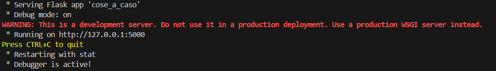
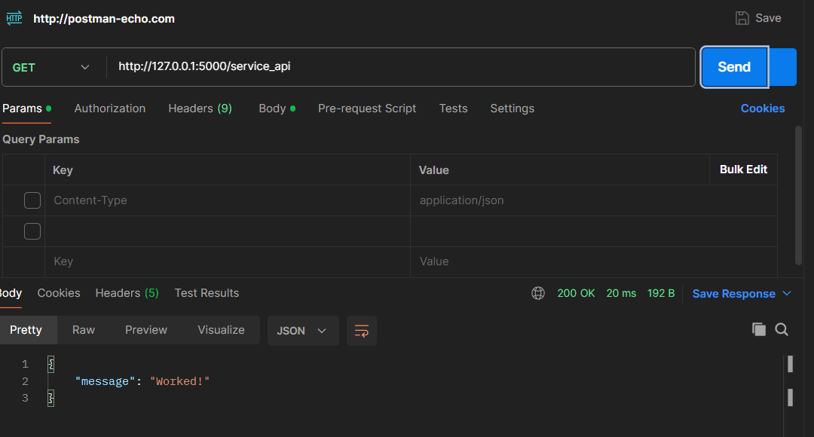
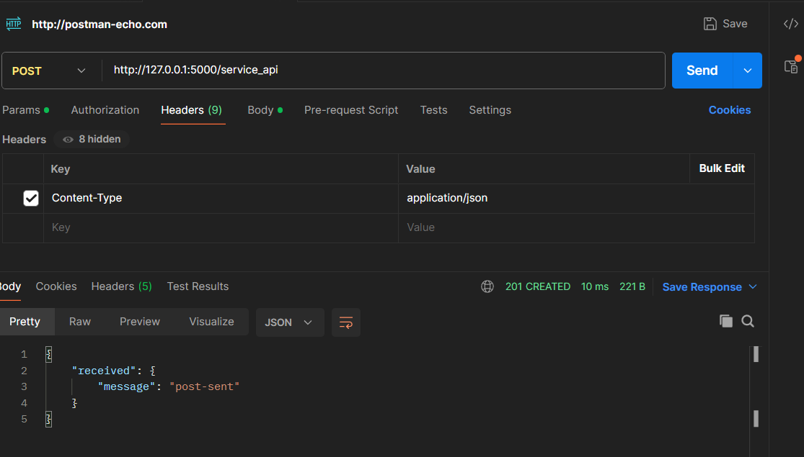
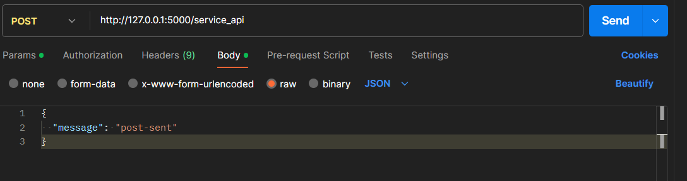

# Localhost-REST-Service-in-Python-with-Flask
A simple localhost rest service with flask

## Introduction of rest service
A RESTful service, or RESTful API, is a way for two computer systems to communicate over the internet in a secure and efficient manner. REST stands for Representational State Transfer, which is an architectural style that imposes conditions on how an API should work.

Here are some key points about RESTful services:
 - Stateless: Each request from a client to a server must contain all the information the server needs to fulfill that request. The server does not store any state about the client session.
 - Client-Server Architecture: The client and server are separate entities that communicate over a network. This separation allows for independent evolution of the client and server.
 - Uniform Interface: RESTful services use standard HTTP methods like GET, POST, PUT, and DELETE to perform operations on resources, which are identified by URLs.
 - Scalability: RESTful services are designed to be scalable and can handle a large number of requests efficiently.
 - Resource-Based: Everything in a RESTful service is considered a resource, which can be represented in formats like JSON or XML.


## Start the service
Run the code in "Code" folder to start the service and open postman to test some get and post requests.
<br>

<br><br>

## Test get request
Insert the url and click send
```
http://127.0.0.1:5000/service_api
```
<br>

<br><br>


## Test post request


### Set the headers
headers
```
{Content-Type:application/json}
```
<br>

<br><br>
### Set the body
Body
```
{
  "message": "post-sent"
}
```
<br>

<br><br>

## Result request post
Check on the terminal the result of the requests
<br>

<br><br>


# Author
<b>Xiao Li Savio Feng</b>
